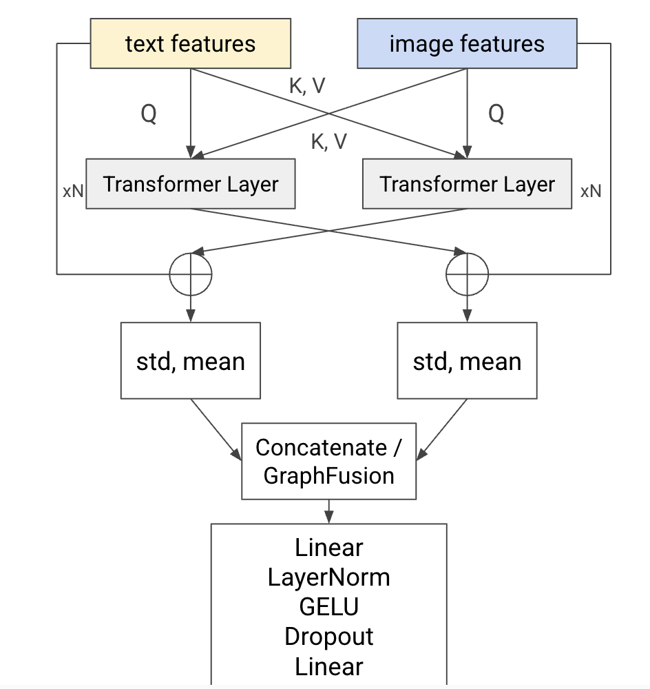

### Проект по курсу "Мультимодальные модели: Архитектуры, Обучение и Применение"  
Коряковская Дарья Олеговна  
Задача - решение [соревнования](https://www.kaggle.com/competitions/avito-demand-prediction/overview) на Kaggle.  
Цель - предсказание вероятности продажи товара на платформе Avito на основе данных предложения (заголовок, описание, изображение, цена, город и тд).  
Метрика - RMSE  
Архитектура: [](model.png)

Эксперименты с последней моделью: ```notebooks/image-text_cross-attention_graph_fusion.ipynb```
[Результаты](https://docs.google.com/presentation/d/1E7Eyua4KxAKEWwGum09MxPNp6gc7SXh3xrvD0nu9Odw/edit?usp=sharing)  
### Используемые модели и данные
Данные доступны в рамках [соревнования](https://www.kaggle.com/competitions/avito-demand-prediction/overview)  

```
@misc{sturua2024jinaembeddingsv3multilingualembeddingstask,
      title={jina-embeddings-v3: Multilingual Embeddings With Task LoRA}, 
      author={Saba Sturua and Isabelle Mohr and Mohammad Kalim Akram and Michael Günther and Bo Wang and Markus Krimmel and Feng Wang and Georgios Mastrapas and Andreas Koukounas and Andreas Koukounas and Nan Wang and Han Xiao},
      year={2024},
      eprint={2409.10173},
      archivePrefix={arXiv},
      primaryClass={cs.CL},
      url={https://arxiv.org/abs/2409.10173}, 
}

@misc{wu2020visual,
      title={Visual Transformers: Token-based Image Representation and Processing for Computer Vision}, 
      author={Bichen Wu and Chenfeng Xu and Xiaoliang Dai and Alvin Wan and Peizhao Zhang and Zhicheng Yan and Masayoshi Tomizuka and Joseph Gonzalez and Kurt Keutzer and Peter Vajda},
      year={2020},
      eprint={2006.03677},
      archivePrefix={arXiv},
      primaryClass={cs.CV}
}

@inproceedings{deng2009imagenet,
  title={Imagenet: A large-scale hierarchical image database},
  author={Deng, Jia and Dong, Wei and Socher, Richard and Li, Li-Jia and Li, Kai and Fei-Fei, Li},
  booktitle={2009 IEEE conference on computer vision and pattern recognition},
  pages={248--255},
  year={2009},
  organization={Ieee}
}
```

